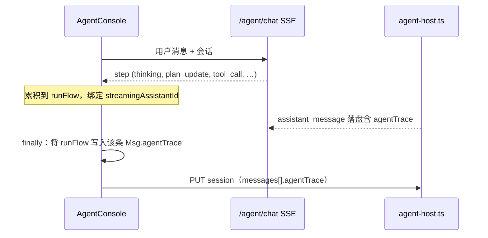

# Agent 执行流与任务规划（Web UI）

本文说明 **Agent 控制台** 中类似 **Cursor Agent** 的「执行轨」展示：思考、可选的 `task_plan`（Todo 式步骤）、工具调用与结果如何产生、如何在界面上挂载到**每一条助手消息**，以及如何随会话落盘与恢复。

## 目标行为

- **按轮次归属**：每一轮助手回复在气泡**上方**有独立的「Agent 执行流」折叠面板；用户发起新一轮提问后，**上一轮**的思考与工具轨迹仍保留在该轮助手消息上，不会消失。
- **进行中 vs 历史**：当前正在流式生成的那条助手消息使用实时 SSE 累积的 `runFlow`；已完成的消息从 **`agentTrace`** 读取（与落盘一致）。
- **规划**：模型在复杂任务上可先调用宿主工具 **`task_plan`**（仅 UI/协议层，不经过 Zig `agent-tool`）。宿主在真正执行工具前发出 **`plan_update`** 步骤事件，前端渲染为带状态的步骤列表（类比子任务 / 子 Agent 的规划条）。

## 数据流（简图）

## SSE `step` 事件

宿主在 `web/server/agent-host.ts` 中向客户端推送 `step`（JSON 内 `kind` 区分）。与执行轨相关的种类包括：

| `kind` | 含义 |
|--------|------|
| `thinking` | 可合并的推理/思考文本（Markdown） |
| `plan_update` | 任务规划刷新：`thought`（可选）、`steps`（`id` / `title` / `status` / `detail`） |
| `tool_call` / `tool_result` | 工具名与参数/结果摘要 |
| `request_start`、生命周期类 | 连接与轮次上下文（可选展示） |

`plan_update` 在模型发起 **`task_plan`** 工具调用时由宿主**本地**生成（不派生子进程），用于在 UI 上固定一帧「规划」卡片；后续实际原子工具仍走 `tool_call` / `tool_result`。

## 前端状态（`AgentConsole.tsx`）

- **`runFlow`**：`RunFlowItem[]`，仅表示**当前流式**这一轮的事件序列。
- **`streamingAssistantId`**：当前正在接收 SSE 的助手消息 `localId`，用于把 `runFlow` 挂到正确气泡上。
- **`runFlowRef`**：与 `runFlow` 同步，在 `finally` 中快照，避免闭包读到陈旧数组。
- **`Msg.agentTrace`**：该轮结束后与 `runFlow` 快照一致，用于渲染与持久化。

历史消息只读 **`m.agentTrace`**；进行中消息读 **`runFlow`**（当 `m.localId === streamingAssistantId`）。

## 会话落盘

- `PUT /agent/history/session`（见 `agent-host.ts`）接受每条助手消息可选字段 **`agentTrace`**（JSON 数组），服务端会做体积与形状校验（`sanitizeAgentTracePayload`）。
- 前端 `messagesToDisk` / `clampTraceForDisk` 限制条目数量，避免 JSONL 过大。
- `loadSession` 从 `assistant_message` 的 `payload.agentTrace` **反序列化**回 `Msg`，刷新页面后执行轨仍在。

## 系统提示

模型侧约定见 `prompts/agent-system.zh.md`：先简要思考 → 复杂任务用 **`task_plan`** 列出步骤 → 再调用原子工具 → 最后作答。

## 相关源码

| 路径 | 说明 |
|------|------|
| `web/server/agent-host.ts` | SSE、`plan_update`、`agentTrace` 持久化 |
| `web/server/agent-tools.ts` | `task_plan` 工具定义与本地派发 |
| `web/src/pages/AgentConsole.tsx` | 执行轨 UI、`runFlow` / `agentTrace` |
| `web/src/App.css` | `.gpt-cursor-agent-rail`、`.gpt-plan-todo-*` 等样式 |
| `prompts/agent-system.zh.md` | 工作流与工具使用说明 |
