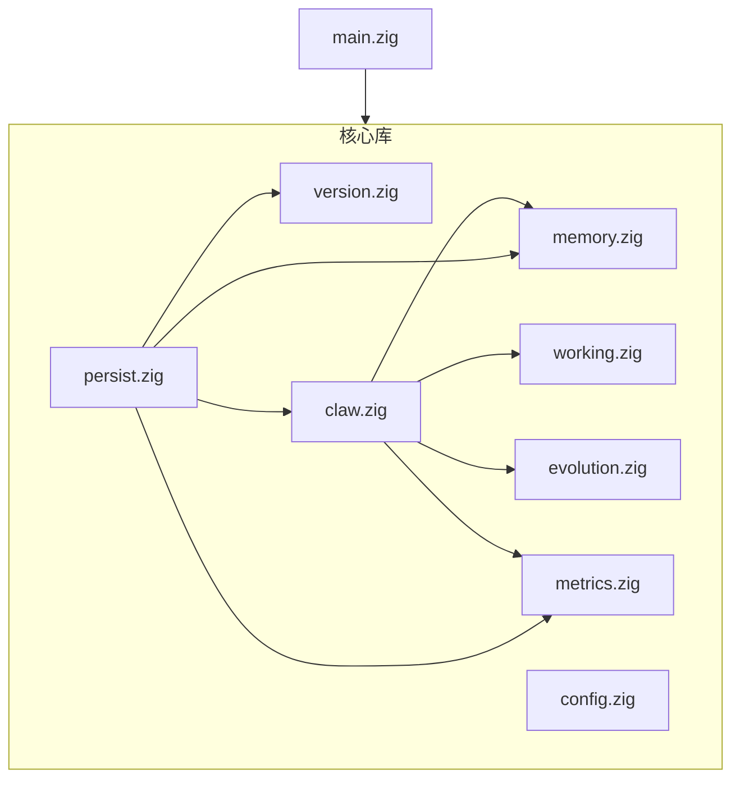

# CuteClaw 架构说明（0.2）

## 1. 目标与边界

- **目标**：提供可嵌入的**记忆 + 进化门禁 + 指标 + 持久化**内核，对应「分层记忆、显式工作区、提议—检查—合并—观测」闭环中的**确定性部分**。
- **边界（刻意不做）**：LLM 调用、工具执行、网络、向量检索、UI、操作系统沙箱。这些由宿主进程实现，再通过本库的 API 写入记忆与指标。

## 2. 模块依赖

- **`ClawRuntime`**：`ArenaAllocator` 托管情景/技能/事实与工作区字符串；**`MetricsRegistry`** 使用独立 `gpa`（与构造时传入的父分配器相同），存放 rollup 与审计，避免与 Arena 生命周期纠缠。
- **`persist`**：只依赖 `claw` / `memory` / `metrics` / `version`，**不**反向依赖 `main`。

## 3. 进化闭环（库内实现范围）

| 阶段 | 实现位置 | 行为 |
|------|-----------|------|
| Propose | 宿主 / JSON 文件 | 构造 `evolution.Proposal` |
| Check | `evolution.checkProposal` | 体长度、摘要长度、技能名长度、正文上限 |
| Merge | `evolution.decideMerge` + `ClawRuntime.applyProposal` | `MergePolicy`：`dry_run` / `require_human` → `deferred`；`auto_append_only` → 校验 semver 后 `accepted` 并 append 技能 |
| Observe | `metrics.recordEvolution` | 每条合并写审计；`accepted` 时更新对应 rollup 的 `last_patch_unix` |

任务级观测：`recordTask`、`recordSkillInvocation` 由宿主在合适时机调用。

## 4. 持久化与一致性

- **格式**：见 [format.md](format.md)。
- **加载**：`resetContent` 清空 Arena 列表与指标，再按序灌入；**审计在 rollup 之后重放**，以接近保存时的副作用（`accepted` 会 bump `last_patch_unix`）。
- **并发**：对默认 CLI 路径，在 `store.json` 同目录使用 **`store.json.lock` 咨询锁**（`store_lock.zig`）串行化读改写；**咨询锁不约束**直接绕过锁 API 写文件的进程。嵌入其它宿主时仍需自管一致性。
- **HTTP**：`cuteclaw serve` 仅绑定 **`127.0.0.1`**，提供旧版路由（`/health`、`/store`、`/status`、`POST /evolve`）及与 `web/src/api/client.ts` 对齐的 **`/api/*`**，见 `src/serve.zig`。开发时推荐 Vite 将 `/api` 代理到默认 **8788**（`VITE_API_PORT` 可改）。可选的 Node `web/server`（默认 **8787**）仍可单独使用，与 Zig 端口错开即可。

## 5. CLI 设计

`main.zig` 为**无图形 UI** 运维面：初始化目录、演示、导入导出、**`evolve`** / `validate`、追加情景与 invoke 统计、**`config show` / `config init` / `config validate`**（`config.json`）、**`working` / `fact`**、**`serve`**、**`memory`**（读写 Agent `cache/projects/<id>/memory`，与 Web 项目布局一致）、**`agent-tool`**（stdin JSON 原子工具，供 Web Agent 宿主子进程调用）。路径支持 `--store` / `CUTECLAW_STORE` 与 **`--config` / `CUTECLAW_CONFIG`**。

Web Agent 宿主的 **function calling** 不直接在 Node 内执行 shell/文件逻辑，而是委托 **`cuteclaw agent-tool`**，见 [agent-tools.md](agent-tools.md)。其中 **`task_plan`** 仅为协议/UI 用，由宿主本地处理并发 SSE **`plan_update`**；多轮对话的「执行轨」随助手消息 **`agentTrace`** 落盘，见 [agent-execution-flow.zh.md](agent-execution-flow.zh.md)。

### 进化（evolve）与 Web

- **提议校验与合并的权威实现**在 Zig：`cuteclaw evolve --file … --policy … --semver …`。
- Web 控制台中的 **Evolve** 仅通过 HTTP 调用与仓库相关的 API（如 `web/src/api/client.ts` → Zig `serve` 的 `/api/evolve`），便于填表；**批处理与 CI 应以 CLI 为准**。

### Agent memory

- 项目化后的记忆文件由 **`cuteclaw memory`** 子命令管理；与 Node Agent 宿主使用同一相对路径约定（见 [agent-cache.md](agent-cache.md)）。

## 6. 版本

`src/version.zig` 为语义版本单一来源；`build.zig.zon` 的 `version` 字段应与之一致；快照中的 `library_version` 在导出时写入，便于排查兼容问题。
